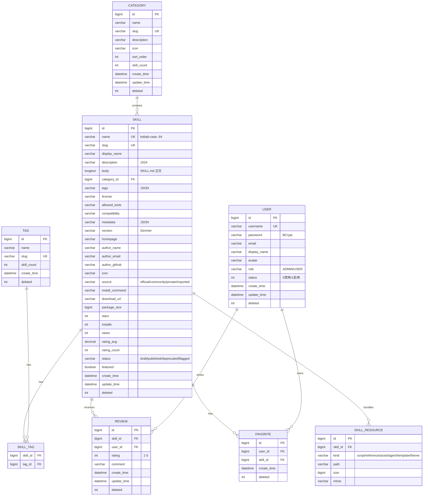

# SkillsMap ER 图

## 关键设计

1. **逻辑删除**：所有主表（除 SKILL_RESOURCE 外）都有 `deleted` 字段（0/1），由 MyBatis-Plus `@TableLogic` 自动过滤
2. **审计字段**：`create_time` / `update_time` 由 Service 显式设置
3. **唯一约束**：
   - `skill.name` / `skill.slug` 唯一
   - `user.username` 唯一
   - `tag.slug` 唯一
   - `review(skill_id, user_id)` 业务唯一（一用户一评）
   - `favorite(user_id, skill_id)` 唯一
4. **JSON 字段**：`tags` / `metadata` 用 JSON 字符串存（避免多表 JOIN）
5. **冗余统计**：`category.skill_count` / `tag.skill_count` / `skill.rating_avg/count` 冗余以加速查询
