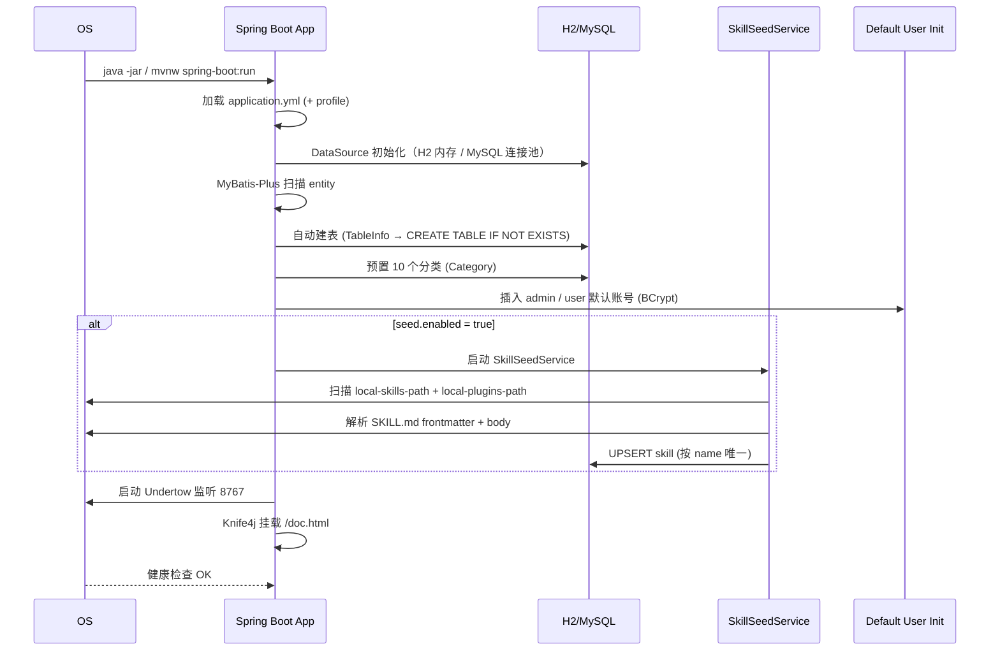
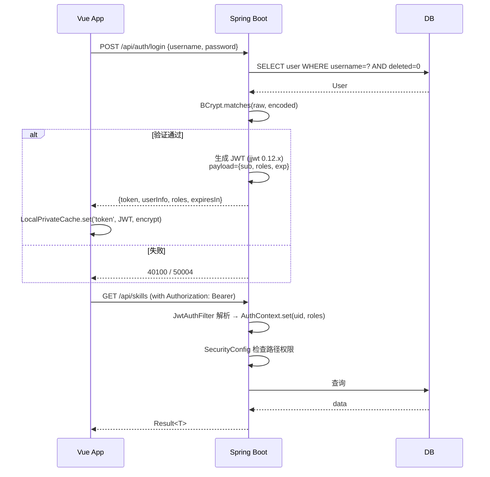
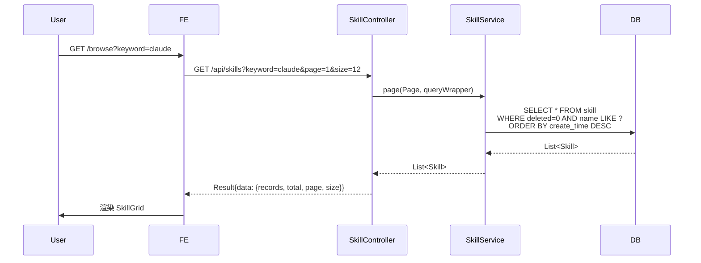

# Tech Architecture（技术架构）

> 作者：dev-kevin @ Sprint 0 Kickoff (2026-06-06)
>
> 版本：v0.1 · 范围：v1 现状总结 · 引用：`.claude/CLAUDE.md` / `docs/ER.md` / `docs/API.md` / `docs/SEED_DATA.md`

## 1. 技术栈摘要

| 层 | 选型 | 版本 | 备注 |
|---|---|---|---|
| 后端语言 | Java | 21 | LTS |
| 后端框架 | Spring Boot | 3.5.7 | — |
| ORM | MyBatis-Plus | 3.5.12 | **禁用** JPA |
| Web 容器 | Undertow | （随 Spring Boot） | **禁用** Tomcat |
| 安全 | Spring Security + JJWT | 6.x / 0.12.x | 无状态 JWT |
| API 文档 | Knife4j + springdoc-openapi | 4.x / 2.x | 路径 `/doc.html` |
| 数据库（dev） | H2 | 2.x | MySQL 兼容 + LowerCase |
| 数据库（prod） | MySQL | 8.3 | — |
| 连接池 | Druid | 1.2.x | 含 SQL 监控 |
| 工具库 | Lombok + Hutool + Guava + Fastjson2 | — | — |
| 加密 | Jasypt | 3.x | yml 敏感字段 |
| 前端构建 | Vite | 7 | — |
| 前端语言 | TypeScript | 5.8 | 严格模式 |
| 前端框架 | Vue | 3.5 | Composition + Options |
| 状态 | Pinia | 3 | Options API + LocalPrivateCache 持久化 |
| UI 库 | Ant Design Vue | 4 | 唯一 UI 库 |
| 路由 | Vue Router | 4 | meta.requiresAuth / meta.requiresAdmin |
| HTTP | axios | 1.x | 单例 + `ajax.ts` (path-to-regexp) |
| Markdown | markdown-it | 14.x | 详情页渲染 |
| CI/CD | 待定（Sprint 1 选型） | — | 见 `15_cicd_plan.md` |

## 2. 后端模块图

```
┌────────────────────────────────────────────────────────────────┐
│                     HTTP Client (Browser / curl)                │
└─────────────────────────────┬──────────────────────────────────┘
                              │  Authorization: Bearer <token>
                              ▼
┌────────────────────────────────────────────────────────────────┐
│                Undertow (Spring Boot Embedded)                   │
├────────────────────────────────────────────────────────────────┤
│  Spring Security Filter Chain                                   │
│  └─ JwtAuthFilter ──► AuthContext (ThreadLocal)                 │
├────────────────────────────────────────────────────────────────┤
│  GlobalExceptionHandler ──► BizException ──► Result<T>          │
├────────────────────────────────────────────────────────────────┤
│  rest/                       (HTTP Entry)                        │
│  ├─ AuthController            /api/auth/**                      │
│  ├─ SkillController           /api/skills/** (公开)             │
│  ├─ CategoryController        /api/categories                   │
│  ├─ TagController             /api/tags                         │
│  ├─ ReviewController          /api/reviews                      │
│  ├─ FavoriteController        /api/favorites/**                 │
│  └─ admin/                    /api/admin/**  (ROLE_ADMIN)       │
│      ├─ AdminSkillController                                     │
│      ├─ AdminCategoryController                                  │
│      ├─ AdminTagController                                       │
│      ├─ AdminUserController                                      │
│      └─ AdminDashboardController                                 │
├────────────────────────────────────────────────────────────────┤
│  service/                    (业务编排)                          │
│  ├─ UserService                impl/UserServiceImpl             │
│  ├─ SkillService               impl/SkillServiceImpl            │
│  ├─ CategoryService            impl/CategoryServiceImpl         │
│  ├─ TagService                 impl/TagServiceImpl              │
│  ├─ ReviewService              impl/ReviewServiceImpl           │
│  ├─ FavoriteService            impl/FavoriteServiceImpl         │
│  ├─ GitSyncService             impl/GitSyncServiceImpl (ZIP/git)│
│  └─ SkillStorageService        impl/SkillStorageServiceImpl     │
├────────────────────────────────────────────────────────────────┤
│  mapper/ (MyBatis-Plus BaseMapper)                               │
│  ├─ UserMapper   SkillMapper   CategoryMapper   TagMapper       │
│  ├─ ReviewMapper FavoriteMapper SkillResourceMapper              │
├────────────────────────────────────────────────────────────────┤
│  entity/ (POJO + @TableField 显式映射 + @TableLogic)            │
│  └─ User Skill Category Tag Review Favorite SkillResource       │
├────────────────────────────────────────────────────────────────┤
│  seed/                                                            │
│  └─ SkillSeedService (启动扫描 SKILL.md → 入库)                 │
├────────────────────────────────────────────────────────────────┤
│  config/                                                         │
│  ├─ SecurityConfig   JwtAuthFilter (in security/)               │
│  ├─ MyBatisPlusConfig                                                 │
│  ├─ OpenApiConfig    (springdoc + knife4j)                       │
│  ├─ SeedProperties   StorageProperties                            │
│  └─ WebConfig        (CORS / 拦截器)                              │
├────────────────────────────────────────────────────────────────┤
│  common/                                                         │
│  ├─ Result<T>   ListResult<T>   BizCode   BizException          │
│  └─ GlobalExceptionHandler                                       │
├────────────────────────────────────────────────────────────────┤
│  util/   request/   response/   security/                          │
└────────────────────────────────────────────────────────────────┘
                              │
                              ▼
┌────────────────────────────────────────────────────────────────┐
│   MyBatis-Plus   ──►   H2 (dev) / MySQL 8.3 (local/prod)        │
│   自动建表 (首次)   +   逻辑删除 (deleted=0)                       │
└────────────────────────────────────────────────────────────────┘
```

## 3. 前端架构图

```
┌────────────────────────────────────────────────────────────────┐
│  Browser (Vue 3.5 + TS 5.8)                                     │
│  ┌──────────────────────────────────────────────────────────┐  │
│  │  Vite 7 dev server (端口 7777)                            │  │
│  │  /api ──► proxy ──► http://127.0.0.1:8767                 │  │
│  └──────────────────────────────────────────────────────────┘  │
│                                                                  │
│  App.vue                                                         │
│  ├─ AppHeader (logo / 搜索 / 登录 / 头像)                        │
│  ├─ <router-view> (懒加载视图)                                  │
│  └─ AppFooter                                                    │
│                                                                  │
│  ┌─────────── Stores (Pinia 3, Options API) ───────────────┐   │
│  │  auth.ts  ─► token / userInfo / roles (LocalPrivateCache)│   │
│  │  app.ts   ─► theme / locale / sidebar collapsed         │   │
│  └──────────────────────────────────────────────────────────┘   │
│                                                                  │
│  ┌─────────── HTTP ────────────────────────────────────────┐   │
│  │  axios 单例 + ajax.ts (path-to-regexp 编译 URL)         │   │
│  │  + 拦截器：401 跳 /login / 5xx toast                    │   │
│  └──────────────────────────────────────────────────────────┘   │
│                                                                  │
│  ┌─────────── Views (router 懒加载) ───────────────────────┐   │
│  │  HomeView  BrowseView  SkillDetailView  CategoriesView │   │
│  │  LoginView  RegisterView                                │   │
│  │  ProfileView  MyFavoritesView  MyReviewsView           │   │
│  │  admin/  AdminLayout  DashboardView  ...                │   │
│  └──────────────────────────────────────────────────────────┘   │
│                                                                  │
│  ┌─────────── Components ────────────────────────────────┐    │
│  │  SkillCard  SkillGrid  SkillForm  MarkdownView         │    │
│  │  InstallCommandBox  RatingStars  SourceTag  StatusTag   │    │
│  │  EmptyState  ImportButton                               │    │
│  └──────────────────────────────────────────────────────────┘   │
│                                                                  │
│  auto-import: unplugin-auto-import + unplugin-vue-components    │
│  ─► 自动注册 Vue / Vue Router / Pinia / AntDV 4                   │
└────────────────────────────────────────────────────────────────┘
```

## 4. 启动时序（Backend）



## 5. 关键依赖（pom.xml 节选）

```xml
<dependencies>
  <!-- Web -->
  <dependency>
    <groupId>org.springframework.boot</groupId>
    <artifactId>spring-boot-starter-web</artifactId>
    <exclusions>
      <exclusion>  <!-- 禁用 Tomcat -->
        <groupId>org.springframework.boot</groupId>
        <artifactId>spring-boot-starter-tomcat</artifactId>
      </exclusion>
    </exclusions>
  </dependency>
  <dependency>
    <groupId>org.springframework.boot</groupId>
    <artifactId>spring-boot-starter-undertow</artifactId>
  </dependency>

  <!-- Security + JWT -->
  <dependency>
    <groupId>org.springframework.boot</groupId>
    <artifactId>spring-boot-starter-security</artifactId>
  </dependency>
  <dependency>
    <groupId>io.jsonwebtoken</groupId>
    <artifactId>jjwt-api</artifactId>
    <version>0.12.6</version>
  </dependency>
  <dependency>
    <groupId>io.jsonwebtoken</groupId>
    <artifactId>jjwt-impl</artifactId>
    <version>0.12.6</version>
    <scope>runtime</scope>
  </dependency>
  <dependency>
    <groupId>io.jsonwebtoken</groupId>
    <artifactId>jjwt-jackson</artifactId>
    <version>0.12.6</version>
    <scope>runtime</scope>
  </dependency>

  <!-- MyBatis-Plus + Druid -->
  <dependency>
    <groupId>com.baomidou</groupId>
    <artifactId>mybatis-plus-spring-boot3-starter</artifactId>
    <version>3.5.12</version>
  </dependency>
  <dependency>
    <groupId>com.alibaba</groupId>
    <artifactId>druid-spring-boot-3-starter</artifactId>
    <version>1.2.24</version>
  </dependency>

  <!-- H2 + MySQL -->
  <dependency>
    <groupId>com.h2database</groupId>
    <artifactId>h2</artifactId>
    <scope>runtime</scope>
  </dependency>
  <dependency>
    <groupId>com.mysql</groupId>
    <artifactId>mysql-connector-j</artifactId>
    <scope>runtime</scope>
  </dependency>

  <!-- API 文档 -->
  <dependency>
    <groupId>com.github.xiaoymin</groupId>
    <artifactId>knife4j-openapi3-jakarta-spring-boot-starter</artifactId>
    <version>4.5.0</version>
  </dependency>

  <!-- 工具 -->
  <dependency>
    <groupId>org.projectlombok</groupId>
    <artifactId>lombok</artifactId>
    <optional>true</optional>
  </dependency>
  <dependency>
    <groupId>cn.hutool</groupId>
    <artifactId>hutool-all</artifactId>
    <version>5.8.x</version>
  </dependency>
  <dependency>
    <groupId>com.github.ulisesbocchio</groupId>
    <artifactId>jasypt-spring-boot-starter</artifactId>
    <version>3.0.5</version>
  </dependency>

  <!-- 测试 -->
  <dependency>
    <groupId>org.springframework.boot</groupId>
    <artifactId>spring-boot-starter-test</artifactId>
    <scope>test</scope>
  </dependency>
</dependencies>
```

## 6. 鉴权流程



## 7. 数据流：浏览 SKILL



## 8. 关键技术债与风险

> 完整风险登记见 `09_risk_register.md`；本节仅列与架构强相关的。

| ID | 技术债 | 影响 | 何时解决 |
|---|---|---|---|
| TD-01 | `SkillService` 当前已存在但 README 与 PRD 描述的"30+ skill 入库"性能未压测 | 中 | Sprint 1 US-005/006 验收时测 |
| TD-02 | 鉴权用 ThreadLocal 存 `AuthContext`，异步场景（@Async）会丢上下文 | 中 | Sprint 1 若引入异步任务时处理 |
| TD-03 | markdown 渲染未做 XSS sanitization（R-09） | **高** | Sprint 1 US-011 必做（DOMPurify） |
| TD-04 | 静态资源无 CDN，所有 skill 包 / 截图走本地 `backend/data/skill-packages/` | 中 | v1.1 |
| TD-05 | 默认账号 admin/admin123 文档公开（R-12/D-05 决议保留，但首登强提示改密） | 中 | Sprint 1 加首登提示 |
| TD-06 | 无审计日志（User 角色变更、Skill 上下架） | 中 | v1.2 |
| TD-07 | 无 API 限流（恶意刷列表 / 登录爆破） | 中 | v1.1 |
| TD-08 | 前端 Pinia 持久化用 LocalPrivateCache，token 加密 key 在前端代码里 | 中 | 接受（Sprint 1 不动） |

## 9. 命名规范摘要（与 `.claude/CLAUDE.md` 一致）

- **Java 类**：`UserService` / `SkillController`
- **Java 包**：禁止 `controller`；用 `rest`
- **表名**：`skill` / `user` / `category`（小写蛇形，复数概念用关联表如 `skill_tag`）
- **API 路径**：`/api/skills` 复数；`/api/skills/{id}` 资源
- **前端组件**：`SkillCard.vue` / `MarkdownView.vue`
- **前端路由**：`/browse-skills` → 视图 `BrowseSkillsView.vue`（v1 当前未严格用此命名，将在 Sprint 1 校准）
- **常量**：`MAX_PAGE_SIZE` / `DEFAULT_TOKEN_TTL_SECONDS`

## 10. 数据隔离

| 维度 | 规则 |
|---|---|
| 逻辑删除 | 所有主表 `deleted=0/1`，由 MyBatis-Plus `@TableLogic` 自动过滤 |
| 多租户 | 不支持（v1 单租户） |
| 数据导出 | 无 |
| 软删除恢复 | Admin 后台提供（US-024 扩展） |

## 11. 性能预算

| 指标 | 目标 | 备注 |
|---|---|---|
| API P50 | ≤ 100ms | 列表类 |
| API P95 | ≤ 300ms | 含 JOIN 的 |
| 详情页 P95 | ≤ 500ms | 含 markdown 渲染 |
| 首页 LCP | ≤ 1.5s | Vite dev + H2 |
| 后台 LCP | ≤ 1.5s | 同上 |
| 静态资源 | gzip + cache 1y（带 hash） | Vite 自动 |

## 12. 修订记录

| 版本 | 日期 | 作者 | 摘要 |
|---|---|---|---|
| v0.1 | 2026-06-06 | dev-kevin | 初版技术架构：模块图 + 启动时序 + 鉴权流程 + 8 条技术债 |
